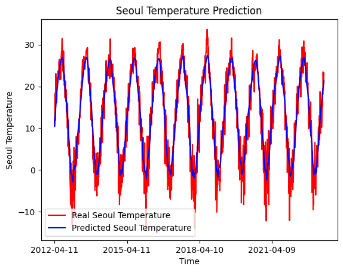

# Import Module


```python
import math
import matplotlib.pyplot as plt
import keras
import pandas as pd
import numpy as np
from keras.models import Sequential
from keras.layers import Dense
from keras.layers import LSTM
from keras.layers import Dropout
from keras.layers import *
from sklearn.preprocessing import MinMaxScaler
from sklearn.metrics import mean_squared_error
from sklearn.metrics import mean_absolute_error
from sklearn.model_selection import train_test_split
from keras.callbacks import EarlyStopping
#please install module(numpy,pandas,matplotlib,plotly,jupyter,scikit-learn) in 'cmd.exe' using 'pip' install "module"' before running
```

# Read File


```python
#Load data file
df=pd.read_csv("Seoul_Date_temperature_data(1990_2023).csv")
#Check the data has been loaded successfully
df
```


<div>
<style scoped>
    .dataframe tbody tr th:only-of-type {
        vertical-align: middle;
    }

    .dataframe tbody tr th {
        vertical-align: top;
    }

    .dataframe thead th {
        text-align: right;
    }
</style>
<table border="1" class="dataframe">
  <thead>
    <tr style="text-align: right;">
      <th></th>
      <th>Date</th>
      <th>STA</th>
      <th>MeanTemp</th>
      <th>MinTemp</th>
      <th>MaxTemp</th>
    </tr>
  </thead>
  <tbody>
    <tr>
      <th>0</th>
      <td>1990-01-01</td>
      <td>108</td>
      <td>-1.7</td>
      <td>-4.0</td>
      <td>1.8</td>
    </tr>
    <tr>
      <th>1</th>
      <td>1990-01-02</td>
      <td>108</td>
      <td>-3.5</td>
      <td>-5.7</td>
      <td>-0.9</td>
    </tr>
    <tr>
      <th>2</th>
      <td>1990-01-03</td>
      <td>108</td>
      <td>-5.0</td>
      <td>-7.2</td>
      <td>-1.7</td>
    </tr>
    <tr>
      <th>3</th>
      <td>1990-01-04</td>
      <td>108</td>
      <td>-3.3</td>
      <td>-8.9</td>
      <td>2.1</td>
    </tr>
    <tr>
      <th>4</th>
      <td>1990-01-05</td>
      <td>108</td>
      <td>0.7</td>
      <td>-2.4</td>
      <td>2.1</td>
    </tr>
    <tr>
      <th>...</th>
      <td>...</td>
      <td>...</td>
      <td>...</td>
      <td>...</td>
      <td>...</td>
    </tr>
    <tr>
      <th>12198</th>
      <td>2023-05-26</td>
      <td>108</td>
      <td>21.4</td>
      <td>15.8</td>
      <td>27.3</td>
    </tr>
    <tr>
      <th>12199</th>
      <td>2023-05-27</td>
      <td>108</td>
      <td>19.3</td>
      <td>18.6</td>
      <td>20.7</td>
    </tr>
    <tr>
      <th>12200</th>
      <td>2023-05-28</td>
      <td>108</td>
      <td>19.2</td>
      <td>18.4</td>
      <td>20.2</td>
    </tr>
    <tr>
      <th>12201</th>
      <td>2023-05-29</td>
      <td>108</td>
      <td>23.2</td>
      <td>19.0</td>
      <td>28.5</td>
    </tr>
    <tr>
      <th>12202</th>
      <td>2023-05-30</td>
      <td>108</td>
      <td>24.0</td>
      <td>20.5</td>
      <td>28.9</td>
    </tr>
  </tbody>
</table>
<p>12203 rows × 5 columns</p>
</div>


# Make Training Dataset


```python
## 1. Split Dataset (training / test)
training_set = df.iloc[:8136:3, 2:3].values
test_set = df.iloc[8136::3, 2:3].values


# Feature Scaling (Normalize training data to improve performance)
sc = MinMaxScaler(feature_range = (0, 1))
training_set_scaled = sc.fit_transform(training_set)

# Creating a data structure with 100 time-steps and 1 output
X_train = []
y_train = []

# 2.Input Dataset
for i in range(100, 2712):
   X_train.append(training_set_scaled[i-100:i, 0])
   y_train.append(training_set_scaled[i, 0])

# Each array into one array
X_train, y_train = np.array(X_train), np.array(y_train)

# 3.Sequential Dataset
X_train = np.reshape(X_train, (X_train.shape[0], X_train.shape[1], 1))
print(X_train.shape)
#(2612, 100, 1)
```

    (2612, 100, 1)
    

# Training


```python
## 4. Build LSTM
#Training 4-layers
model = Sequential()

#Adding the first LSTM layer and some Dropout regularisation
model.add(LSTM(units = 50, return_sequences = True, input_shape = (X_train.shape[1], 1)))
model.add(Dropout(0.2))

# Adding a second LSTM layer and some Dropout regularisation
model.add(LSTM(units = 50, return_sequences = True))
model.add(Dropout(0.2))

# Adding a third LSTM layer and some Dropout regularisation
model.add(LSTM(units = 50, return_sequences = True))
model.add(Dropout(0.2))

# Adding a fourth LSTM layer and some Dropout regularisation
model.add(LSTM(units = 50))
model.add(Dropout(0.2))

# Adding the output layer
model.add(Dense(units = 1))

# Compiling the RNN
model.compile(optimizer = 'adam', loss = 'mean_squared_error')

## 5. Model Training
# Fitting the RNN to the Training set
model.fit(X_train, y_train, epochs = 100, batch_size = 32)
# epoch: Number of times to train the training data set
# batch-size : Amount of data set process at one time when training
```

    Epoch 1/100
    82/82 [==============================] - 14s 99ms/step - loss: 0.0396
    Epoch 2/100
    82/82 [==============================] - 8s 100ms/step - loss: 0.0093
    Epoch 3/100
    82/82 [==============================] - 9s 104ms/step - loss: 0.0088
    Epoch 4/100
    82/82 [==============================] - 9s 105ms/step - loss: 0.0085
    Epoch 5/100
    82/82 [==============================] - 9s 105ms/step - loss: 0.0086
    Epoch 6/100
    82/82 [==============================] - 9s 105ms/step - loss: 0.0077
    Epoch 7/100
    82/82 [==============================] - 9s 106ms/step - loss: 0.0079
    Epoch 8/100
    82/82 [==============================] - 9s 109ms/step - loss: 0.0074
    Epoch 9/100
    82/82 [==============================] - 9s 110ms/step - loss: 0.0075
    Epoch 10/100
    82/82 [==============================] - 9s 114ms/step - loss: 0.0071
    Epoch 11/100
    82/82 [==============================] - 9s 112ms/step - loss: 0.0071
    Epoch 12/100
    82/82 [==============================] - 9s 113ms/step - loss: 0.0071
    Epoch 13/100
    82/82 [==============================] - 9s 113ms/step - loss: 0.0072
    Epoch 14/100
    82/82 [==============================] - 9s 113ms/step - loss: 0.0069
    Epoch 15/100
    82/82 [==============================] - 9s 113ms/step - loss: 0.0068
    Epoch 16/100
    82/82 [==============================] - 9s 113ms/step - loss: 0.0069
    Epoch 17/100
    82/82 [==============================] - 9s 114ms/step - loss: 0.0066
    Epoch 18/100
    82/82 [==============================] - 9s 113ms/step - loss: 0.0063
    Epoch 19/100
    82/82 [==============================] - 9s 114ms/step - loss: 0.0066
    Epoch 20/100
    82/82 [==============================] - 9s 113ms/step - loss: 0.0063
    Epoch 21/100
    82/82 [==============================] - 9s 113ms/step - loss: 0.0063
    Epoch 22/100
    82/82 [==============================] - 9s 113ms/step - loss: 0.0064
    Epoch 23/100
    82/82 [==============================] - 9s 113ms/step - loss: 0.0064
    Epoch 24/100
    82/82 [==============================] - 9s 113ms/step - loss: 0.0060
    Epoch 25/100
    82/82 [==============================] - 9s 113ms/step - loss: 0.0063
    Epoch 26/100
    82/82 [==============================] - 9s 114ms/step - loss: 0.0061
    Epoch 27/100
    82/82 [==============================] - 9s 113ms/step - loss: 0.0058
    Epoch 28/100
    82/82 [==============================] - 9s 113ms/step - loss: 0.0059
    Epoch 29/100
    82/82 [==============================] - 9s 114ms/step - loss: 0.0058
    Epoch 30/100
    82/82 [==============================] - 9s 113ms/step - loss: 0.0059
    Epoch 31/100
    82/82 [==============================] - 9s 113ms/step - loss: 0.0059
    Epoch 32/100
    82/82 [==============================] - 9s 113ms/step - loss: 0.0058
    Epoch 33/100
    82/82 [==============================] - 9s 113ms/step - loss: 0.0057
    Epoch 34/100
    82/82 [==============================] - 9s 113ms/step - loss: 0.0058
    Epoch 35/100
    82/82 [==============================] - 9s 114ms/step - loss: 0.0058
    Epoch 36/100
    82/82 [==============================] - 9s 113ms/step - loss: 0.0056
    Epoch 37/100
    82/82 [==============================] - 9s 113ms/step - loss: 0.0054
    Epoch 38/100
    82/82 [==============================] - 9s 113ms/step - loss: 0.0056
    Epoch 39/100
    82/82 [==============================] - 9s 112ms/step - loss: 0.0055
    Epoch 40/100
    82/82 [==============================] - 9s 113ms/step - loss: 0.0057
    Epoch 41/100
    82/82 [==============================] - 9s 115ms/step - loss: 0.0056
    Epoch 42/100
    82/82 [==============================] - 9s 114ms/step - loss: 0.0055
    Epoch 43/100
    82/82 [==============================] - 10s 118ms/step - loss: 0.0055
    Epoch 44/100
    82/82 [==============================] - 9s 114ms/step - loss: 0.0055
    Epoch 45/100
    82/82 [==============================] - 9s 115ms/step - loss: 0.0053
    Epoch 46/100
    82/82 [==============================] - 9s 114ms/step - loss: 0.0054
    Epoch 47/100
    82/82 [==============================] - 9s 115ms/step - loss: 0.0053
    Epoch 48/100
    82/82 [==============================] - 9s 115ms/step - loss: 0.0054
    Epoch 49/100
    82/82 [==============================] - 9s 114ms/step - loss: 0.0052
    Epoch 50/100
    82/82 [==============================] - 9s 114ms/step - loss: 0.0054
    Epoch 51/100
    82/82 [==============================] - 9s 115ms/step - loss: 0.0053
    Epoch 52/100
    82/82 [==============================] - 9s 114ms/step - loss: 0.0052
    Epoch 53/100
    82/82 [==============================] - 10s 118ms/step - loss: 0.0052
    Epoch 54/100
    82/82 [==============================] - 11s 134ms/step - loss: 0.0053
    Epoch 55/100
    82/82 [==============================] - 12s 140ms/step - loss: 0.0053
    Epoch 56/100
    82/82 [==============================] - 10s 124ms/step - loss: 0.0051
    Epoch 57/100
    82/82 [==============================] - 11s 129ms/step - loss: 0.0053
    Epoch 58/100
    82/82 [==============================] - 10s 123ms/step - loss: 0.0053
    Epoch 59/100
    82/82 [==============================] - 10s 118ms/step - loss: 0.0051
    Epoch 60/100
    82/82 [==============================] - 10s 119ms/step - loss: 0.0053
    Epoch 61/100
    82/82 [==============================] - 10s 118ms/step - loss: 0.0053
    Epoch 62/100
    82/82 [==============================] - 10s 118ms/step - loss: 0.0052
    Epoch 63/100
    82/82 [==============================] - 10s 118ms/step - loss: 0.0052
    Epoch 64/100
    82/82 [==============================] - 10s 122ms/step - loss: 0.0051
    Epoch 65/100
    82/82 [==============================] - 10s 120ms/step - loss: 0.0049
    Epoch 66/100
    82/82 [==============================] - 10s 120ms/step - loss: 0.0050
    Epoch 67/100
    82/82 [==============================] - 10s 119ms/step - loss: 0.0050
    Epoch 68/100
    82/82 [==============================] - 10s 119ms/step - loss: 0.0051
    Epoch 69/100
    82/82 [==============================] - 10s 119ms/step - loss: 0.0052
    Epoch 70/100
    82/82 [==============================] - 10s 119ms/step - loss: 0.0051
    Epoch 71/100
    82/82 [==============================] - 10s 119ms/step - loss: 0.0050
    Epoch 72/100
    82/82 [==============================] - 10s 119ms/step - loss: 0.0050
    Epoch 73/100
    82/82 [==============================] - 10s 125ms/step - loss: 0.0052
    Epoch 74/100
    82/82 [==============================] - 11s 133ms/step - loss: 0.0050
    Epoch 75/100
    82/82 [==============================] - 10s 126ms/step - loss: 0.0049
    Epoch 76/100
    82/82 [==============================] - 10s 122ms/step - loss: 0.0050
    Epoch 77/100
    82/82 [==============================] - 10s 121ms/step - loss: 0.0053
    Epoch 78/100
    82/82 [==============================] - 10s 117ms/step - loss: 0.0049
    Epoch 79/100
    82/82 [==============================] - 10s 119ms/step - loss: 0.0051
    Epoch 80/100
    82/82 [==============================] - 10s 121ms/step - loss: 0.0050
    Epoch 81/100
    82/82 [==============================] - 10s 121ms/step - loss: 0.0050
    Epoch 82/100
    82/82 [==============================] - 10s 119ms/step - loss: 0.0049
    Epoch 83/100
    82/82 [==============================] - 10s 118ms/step - loss: 0.0049
    Epoch 84/100
    82/82 [==============================] - 10s 118ms/step - loss: 0.0049
    Epoch 85/100
    82/82 [==============================] - 10s 118ms/step - loss: 0.0050
    Epoch 86/100
    82/82 [==============================] - 10s 118ms/step - loss: 0.0050
    Epoch 87/100
    82/82 [==============================] - 10s 118ms/step - loss: 0.0050
    Epoch 88/100
    82/82 [==============================] - 10s 121ms/step - loss: 0.0049
    Epoch 89/100
    82/82 [==============================] - 10s 126ms/step - loss: 0.0048
    Epoch 90/100
    82/82 [==============================] - 10s 125ms/step - loss: 0.0049
    Epoch 91/100
    82/82 [==============================] - 10s 119ms/step - loss: 0.0049
    Epoch 92/100
    82/82 [==============================] - 10s 118ms/step - loss: 0.0049
    Epoch 93/100
    82/82 [==============================] - 10s 128ms/step - loss: 0.0049
    Epoch 94/100
    82/82 [==============================] - 11s 129ms/step - loss: 0.0049
    Epoch 95/100
    82/82 [==============================] - 10s 126ms/step - loss: 0.0048
    Epoch 96/100
    82/82 [==============================] - 10s 125ms/step - loss: 0.0048
    Epoch 97/100
    82/82 [==============================] - 10s 123ms/step - loss: 0.0050
    Epoch 98/100
    82/82 [==============================] - 11s 131ms/step - loss: 0.0049
    Epoch 99/100
    82/82 [==============================] - 11s 131ms/step - loss: 0.0048
    Epoch 100/100
    82/82 [==============================] - 11s 129ms/step - loss: 0.0049
    


    <keras.callbacks.History at 0x2d12e4a1e10>


# Make Validation Dateset


```python
## 6. Forecast validation dataset
dataset_train = df.iloc[:8136:3, 2:3]
dataset_test = df.iloc[8136::3, 2:3]
dataset_total = pd.concat((dataset_train, dataset_test), axis = 0)

inputs = dataset_total[len(dataset_total) - len(dataset_test) - 100:].values
inputs = inputs.reshape(-1,1)
inputs = sc.transform(inputs)

X_test = []

for i in range(100, 1456):
   X_test.append(inputs[i-100:i, 0])

X_test = np.array(X_test)
X_test = np.reshape(X_test, (X_test.shape[0], X_test.shape[1], 1))

print(X_test.shape)
dataset_test.head(104)
# (1356, 100, 1)
```

    (1356, 100, 1)
    


<div>
<style scoped>
    .dataframe tbody tr th:only-of-type {
        vertical-align: middle;
    }

    .dataframe tbody tr th {
        vertical-align: top;
    }

    .dataframe thead th {
        text-align: right;
    }
</style>
<table border="1" class="dataframe">
  <thead>
    <tr style="text-align: right;">
      <th></th>
      <th>MeanTemp</th>
    </tr>
  </thead>
  <tbody>
    <tr>
      <th>8136</th>
      <td>12.2</td>
    </tr>
    <tr>
      <th>8139</th>
      <td>10.5</td>
    </tr>
    <tr>
      <th>8142</th>
      <td>13.6</td>
    </tr>
    <tr>
      <th>8145</th>
      <td>18.4</td>
    </tr>
    <tr>
      <th>8148</th>
      <td>12.9</td>
    </tr>
    <tr>
      <th>...</th>
      <td>...</td>
    </tr>
    <tr>
      <th>8433</th>
      <td>-1.1</td>
    </tr>
    <tr>
      <th>8436</th>
      <td>-0.6</td>
    </tr>
    <tr>
      <th>8439</th>
      <td>-11.5</td>
    </tr>
    <tr>
      <th>8442</th>
      <td>-5.8</td>
    </tr>
    <tr>
      <th>8445</th>
      <td>1.1</td>
    </tr>
  </tbody>
</table>
<p>104 rows × 1 columns</p>
</div>


# Prediction


```python
## 7. Predict test dataset
predicted_seoul_temperature = model.predict(X_test)

predicted_seoul_temperature = sc.inverse_transform(predicted_seoul_temperature)
plt.plot(df.loc[8136::3, 'Date'],dataset_test.values, color = 'red', label = 'Real Seoul Temperature')
plt.plot(df.loc[8136::3, 'Date'],predicted_seoul_temperature, color = 'blue', label = 'Predicted Seoul Temperature')

plt.xticks(np.arange(0,1356,365))
plt.title('Seoul Temperature Prediction')
plt.xlabel('Time')
plt.ylabel('Seoul Temperature')
plt.legend()
plt.show()
```

    43/43 [==============================] - 3s 34ms/step
    


    

    


# Scoring


```python
## 8.Check Performance
from datetime import datetime
from sklearn import metrics

df_weather = df.loc[:,["Date","MeanTemp"]]
start_index = datetime(2012,4,11)
df_weather["Date"] = pd.to_datetime(df_weather["Date"])

def checkPerformance(y_true, y_pred):
    r2 = round(metrics.r2_score(y_true, y_pred) * 100, 3)
    corr = round(np.corrcoef(y_true, y_pred)[0, 1], 3)
    mape = round(
        metrics.mean_absolute_percentage_error(y_true, y_pred) * 100, 3)
    rmse = round(metrics.mean_squared_error(y_true, y_pred, squared=False), 3)

    df = pd.DataFrame({
        'R2': r2,
        "Corr": corr,
        "RMSE": rmse,
        "MAPE": mape
    },index=[0])
    return df
###################################################
checkPerformance(np.array(df_weather[df_weather.Date>=start_index].MeanTemp[::3]),np.reshape(predicted_seoul_temperature,-1))
```


<div>
<style scoped>
    .dataframe tbody tr th:only-of-type {
        vertical-align: middle;
    }

    .dataframe tbody tr th {
        vertical-align: top;
    }

    .dataframe thead th {
        text-align: right;
    }
</style>
<table border="1" class="dataframe">
  <thead>
    <tr style="text-align: right;">
      <th></th>
      <th>R2</th>
      <th>Corr</th>
      <th>RMSE</th>
      <th>MAPE</th>
    </tr>
  </thead>
  <tbody>
    <tr>
      <th>0</th>
      <td>90.669</td>
      <td>0.955</td>
      <td>3.239</td>
      <td>2.932650e+15</td>
    </tr>
  </tbody>
</table>
</div>


```python

```
